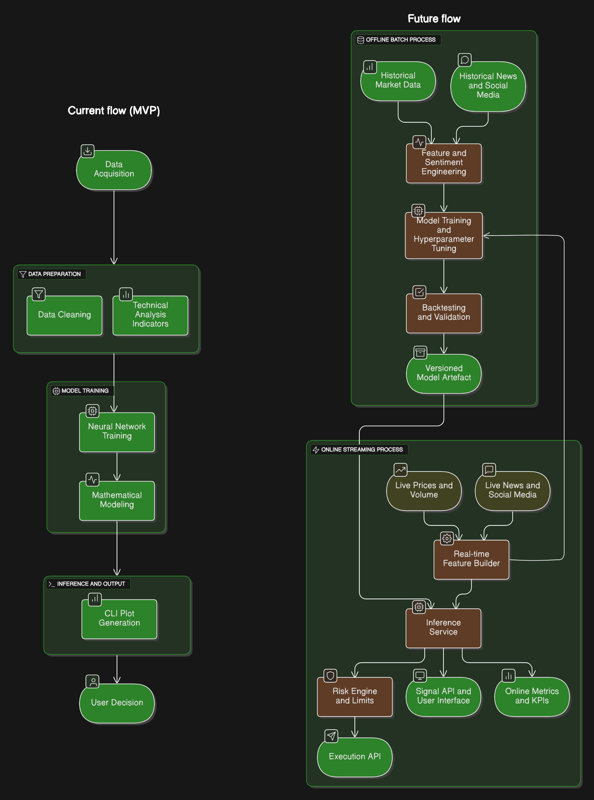

# NeuroTrade – the assistant for next-gen traders.
## An automated market analyst powered by AI and neural networks.

---

## Getting Started

### 1. Clone the repository
```bash
git clone <repo-url>
cd NeuroTrade
```

### Requirements
 - Python 3.9+
 - pip
 - See requirements.txt for all Python dependencies

### 2. Install dependencies
It is recommended to use a virtual environment:

```bash
python3 -m venv venv
source venv/bin/activate
pip install -r 
```

### 3. Run the main notebook
Open main.ipynb in VS Code or Jupyter Notebook:
jupyter notebook [main.ipynb](http://_vscodecontentref_/1)
or in VS Code, simply open the file and run the cells.


### Project Structure
 - **main.ipynb** – Main neural network training and prediction notebook
 - **tests.ipynb** – Additional experiments and model tests
 - **requirements.txt** – List of required Python packages

*Notes:*
 - Data is downloaded automatically from Yahoo Finance.
 - GPU is recommended for faster training (PyTorch supports CUDA).


### Program Flow Diagram


